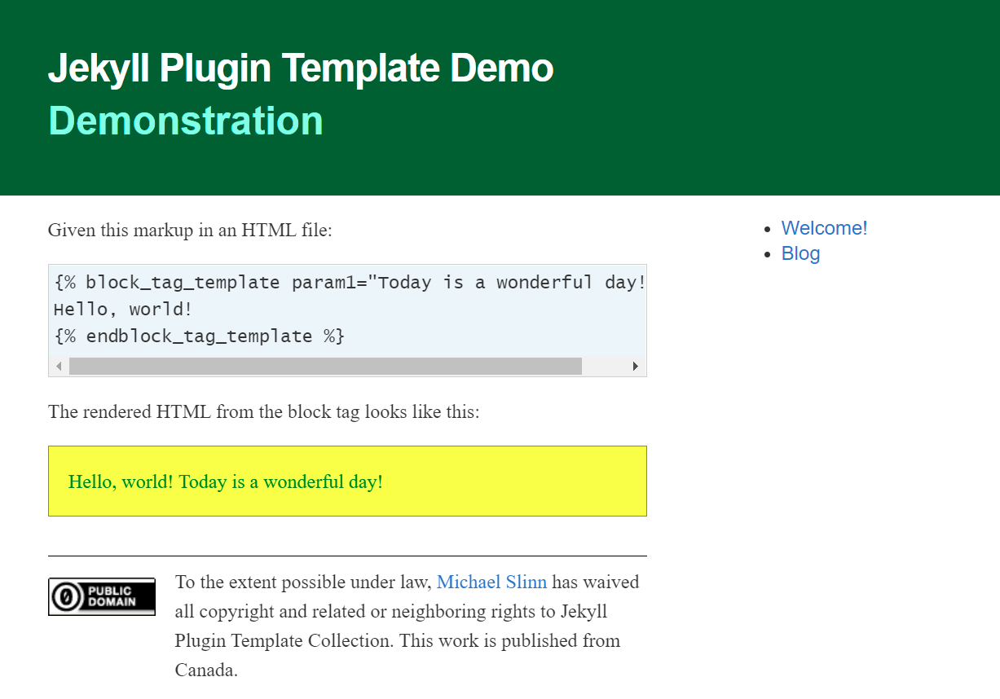

`jekyll_plugin_template`
[](https://badge.fury.io/rb/jekyll_plugin_template)
===========

`jekyll_plugin_template` is a Jekyll plugin that provides a new Liquid tag called `new_tag_name` and a new tag block called `new_tag_block_name`.
The plugin is packaged as a Ruby gem.

 * A `new_tag_block_name` block tag that can do magic with its eyes closed.
   ```
   
   Contents of new_tag_block_name
   
   ```
 * A `new_tag_name` tag that can turn on a dime and leave 15 cents change.
   ```
   
   ```


## Demo
The `demo` directory contains a small Jekyll website pre-configured for instant gratification.
Run the demo by typing:
```shell
$ bin/attach demo
```

The `bin/attach` script builds the plugin locally and installs it locally,
then launches the demo Jekyll website under control of the Ruby Fast Debugger.

As described in [Debugging Jekyll Plugins with an IDE](https://www.mslinn.com/blog/2022/02/21/jekyll-debugging.html),
attach to the process using `ruby-debug-ide` by selecting the **Run / Debug** configuration called **Attach rdebug-ide**.




## Debugging
Run `bin/attach` and pass it the directory name of a Jekyll website that has a suitable script called `_bin/debug`.
The `demo` subdirectory fits this description.
```script
$ bin/attach demo
Successfully uninstalled jekyll_plugin_template-0.1.2
jekyll_plugin_template 0.1.2 built to pkg/jekyll_plugin_template-0.1.2.gem.
jekyll_plugin_template (0.1.2) installed.
Fast Debugger (ruby-debug-ide 0.7.3, debase 0.2.4.1, file filtering is supported) listens on 0.0.0.0:1234
```
Now attach to the debugger process.
This git repo includes a Visual Studio Code launcher for this purpose labeled `Attach rdebug-ide`.


## Additional Information
More information is available on Mike Slinn's web site about
[Jekyll plugins](https://www.mslinn.com/blog/index.html#Jekyll).


## Installation
This has already been done for the demo; these instructions are for incorporating the plugin(s) into other Jekyll websites.
Add this line to your application's Gemfile:

```ruby
group :jekyll_plugins do
  gem 'jekyll_plugin_template'
end
```

And then execute:

    $ bundle install

Or install it yourself as:

    $ gem install jekyll_plugin_template


## Usage

TODO: Write usage instructions here


## Development

After checking out the repo, run `bin/setup` to install dependencies.

You can also run `bin/console` for an interactive prompt that will allow you to experiment.


### Build and Install Locally
To build and install this gem onto your local machine, run:
```shell
$ rake install:local
```

The following also does the same thing:
```shell
$ bundle exec rake install
jekyll_plugin_template 0.1.0 built to pkg/jekyll_plugin_template-0.1.0.gem.
jekyll_plugin_template (0.1.0) installed.
```

Examine the newly built gem:
```shell
$ gem info jekyll_plugin_template

*** LOCAL GEMS ***

jekyll_plugin_template (0.1.0)
    Author: Firstname Lastname
    Homepage:
    https://github.com/username/jekyll_plugin_template
    License: MIT
    Installed at: /home/mslinn/.gems

    Write a short summary; RubyGems requires one.
```


### Build and Push to RubyGems
To release a new version,
  1. Update the version number in `version.rb`.
  2. Commit all changes to git; if you don't the next step might fail with an unexplainable error message.
  3. Run the following:
     ```shell
     $ bundle exec rake release
     ```
     The above creates a git tag for the version, commits the created tag,
     and pushes the new `.gem` file to [RubyGems.org](https://rubygems.org).


## Contributing

1. Fork the project
2. Create a descriptively named feature branch
3. Add your feature
4. Submit a pull request


## License

The gem is available as open source under the terms of the [MIT License](https://opensource.org/licenses/MIT).
